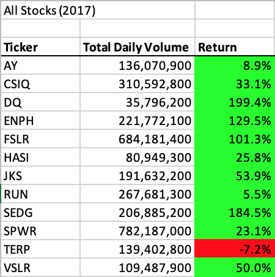
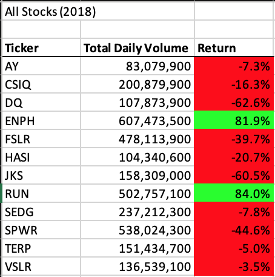
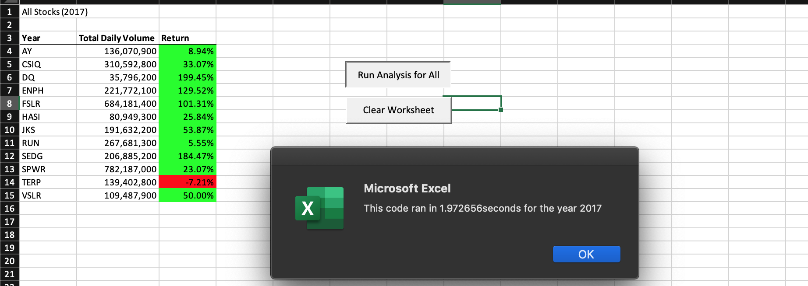
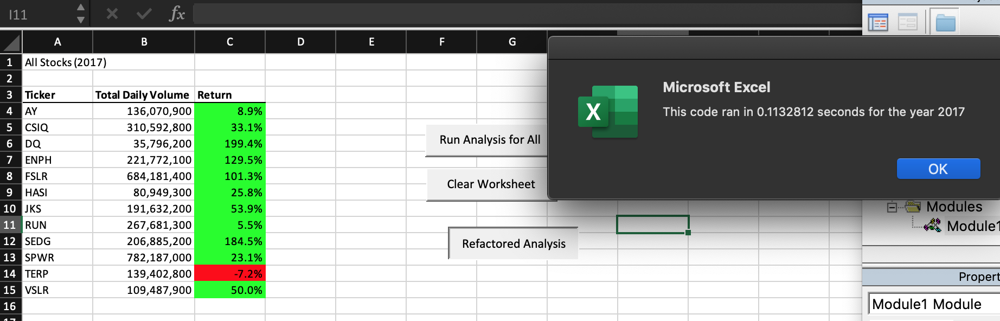
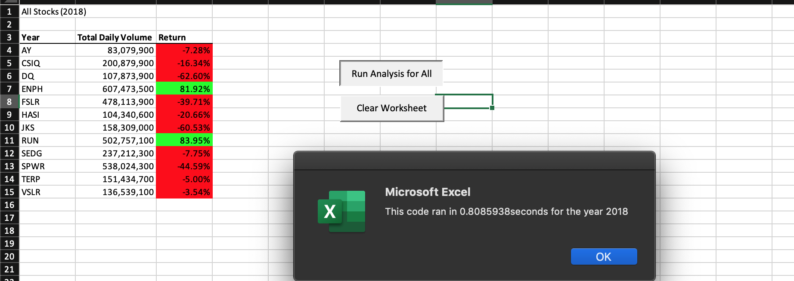
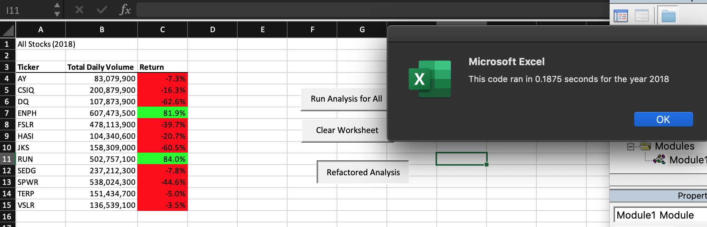

# Stock Analysis

## Overview of Project
Compare stock performance for 12 alternative energy companies.

### Purpose
Using a dataset of 12 alternative energy company stock performances for 2017 and 2018, the included analysis compares each stock performance for volume and returns. The document is designed to allow the user to open the spreadsheet and click the 'Analysis' button before entering either "2017" or "2018" to display the results for the year intended.

## Results
Overall, 2017 was a great year for a majority of the 12 alternative energy stocks analyzed - 11 out of 12 registered gains for the year.

 

2018 was a more difficult year, with only two stocks registering gains for the year. 

- When looking at the included 12 stocks, two registered positive returns for both 2017 and 2018: ENPH & RUN.
- SEDG registered the 2nd highest percentage gain in 2017 (184.5%) but produced a modest loss (-7.8%) in 2018; so over 2 years the stock gain was still higher than the loss the subsequent year. 
- Stock TERP was the only stock in the dataset to register losses in both 2017 and 2018. JKS and SPWR registered losses in 2018 that were greater than gains from 2017, so over the course of two years their losses negated the gains made in the first year.
- To conclude, in terms of returns the three best stocks over both years were: **ENPH, RUN,** & **SEDG**. The three stocks with the worst returns over both years were: **TERP, JKS,** & **SPWR**.

In terms of execution times, the refactored code returned results in much less time than the original green_stocks analysis did originally. For 2017, the execution time decreased from 1.972656 seconds to 0.1132812 seconds. 

 

- For 2018, the execution time decreased from 0.8085938 to 0.1875. 

 
 

While this was a smaller dataset, this could make a significant difference when running a larger dataset. 
- One possible contributing factor was the nested loops in the original green_stocks. The first file (green_stocks) ran analysis through all rows to determine first row of stock ticker and last row of stock ticker in order to analyze each stock ticker results. The refactored version runs through the data once, each index at a time, then says "next": *tickerIndex = tickerIndex + 1*.

## Summary
The obvious advantage to refactoring code is the faster execution time. For 2018, the difference of 0.6210938 seconds may not seem to be worth the effort of refactoring, but for significantly larger datasets that difference would be much more noticeable and would be a desired deliverable from most clients. The disadvantage would be the time invested to modify and test code that worked correctly. Since this is something that mostly occurs behind the scenes, the end result may not be as obvious to the end users who perceive they are seeing the same result while other projects are waiting for the person who invested time refactoring. For some organizations, standardization may be a priority in code consistency. In some instances such as this, refactoring could become a disadvantage unless it was feasible to refactor all code and revise the defined standards. 

For the included analysis, the advantage of faster execution time is evidenced by the above images as a clear "pro." The end result remained the same (in the eyes of the end user). The only "con" in terms of these files is the time spent refactoring - especially in comparison to the improvement of 0.6210938 seconds. If this were a much larger dataset, one could argue the refactoring is in fact worth the faster execution time. 

